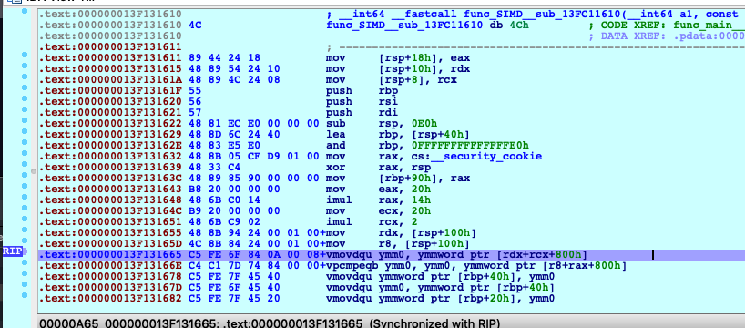
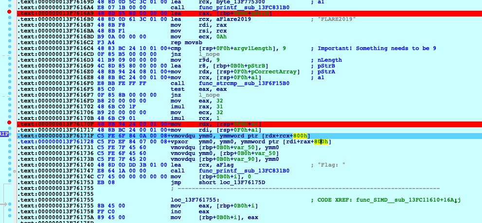
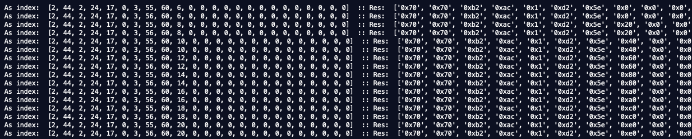
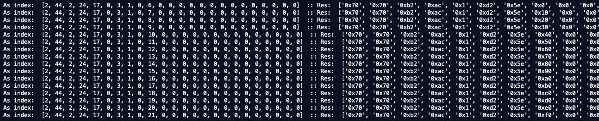

# FlareOn6 :: Challenge 11 :: vv_max

The challenge here is that you're given an .EXE that implements a [VM](https://en.wikipedia.org/wiki/Virtual_machine) using custom [OPCODES](https://en.wikipedia.org/wiki/Opcode). The twist is that the VM uses fancy [AVX2](https://en.wikipedia.org/wiki/Advanced_Vector_Extensions#AVX2) instructions. Finally getting a crackme that used vector instructions was actually something I had been looking forward to for some years now, seeing as I've been using [SIMD](https://en.wikipedia.org/wiki/SIMD) as a games programmer for years on the Xbox 360, Playstation 3, Wii and x64.

For this challenge, however, I was really inspired by knowing that someone completed the entire range of 12 challenges in less than 2 days(!) That told me that it must be possible to complete a complex challenge like this without e.g. implementing a complete VM in e.g. Python or similar.

So I put my love for SIMD aside, and instead decided to treat the program as a blackbox. This meant simply analyzing how the program's output changed depending on my input. At first I wrote a Python script to execute the program with a given set of parameters. Again, qua my gaming/performance background, I knew that creating/destroying a process is really slow. Soon enough my brute forcing approach proved unrealistic.

In the end I patched the program to run in an [infinite loop](https://en.wikipedia.org/wiki/Infinite_loop). I would then use IDA Pro's debugger with a script I wrote that could then brute force within the same process, thus I wouldn't pay the penality of creating/destroying a process every time a tried a new combination. This proved fast enough that I could find 3 bytes within some minutes. I would often double check the resulting bytes by XOR'ing with the result XOR-table, and as soon as I saw my flag begin with "AVX2" then I knew the approach would hold.


## Initial analysis

I always start by running [file](https://en.wikipedia.org/wiki/File_(command)) on the given files to get a feeling of what we're dealing with:

```
$ file *
Message.txt: ASCII text, with no line terminators
vv_max.exe:  PE32+ executable (console) x86-64, for MS Windows
```


## Disassembly

I locate the code that checks if the resulting bytes match a hard coded byte array:



This hard coded byte array is then located, and dumped:

```
Stack[0000056C]:000000000027F360 70                   db  70h ; p
Stack[0000056C]:000000000027F361 70                   db  70h ; p
Stack[0000056C]:000000000027F362 B2                   db 0B2h ; �
Stack[0000056C]:000000000027F363 AC                   db 0ACh ; �
Stack[0000056C]:000000000027F364 01                   db    1
Stack[0000056C]:000000000027F365 D2                   db 0D2h ; �
Stack[0000056C]:000000000027F366 5E                   db  5Eh ; ^
Stack[0000056C]:000000000027F367 61                   db  61h ; a
Stack[0000056C]:000000000027F368 0A                   db  0Ah
Stack[0000056C]:000000000027F369 A7                   db 0A7h ; �
Stack[0000056C]:000000000027F36A 2A                   db  2Ah ; *
Stack[0000056C]:000000000027F36B A8                   db 0A8h ; �
Stack[0000056C]:000000000027F36C 08                   db    8
Stack[0000056C]:000000000027F36D 1C                   db  1Ch
Stack[0000056C]:000000000027F36E 86                   db  86h ; �
Stack[0000056C]:000000000027F36F 1A                   db  1Ah
Stack[0000056C]:000000000027F370 E8                   db 0E8h ; �
Stack[0000056C]:000000000027F371 45                   db  45h ; E
Stack[0000056C]:000000000027F372 C8                   db 0C8h ; �
Stack[0000056C]:000000000027F373 29                   db  29h ; )
Stack[0000056C]:000000000027F374 B2                   db 0B2h ; �
Stack[0000056C]:000000000027F375 F3                   db 0F3h ; �
Stack[0000056C]:000000000027F376 A1                   db 0A1h ; �
Stack[0000056C]:000000000027F377 1E                   db  1Eh
Stack[0000056C]:000000000027F378 00                   db    0
Stack[0000056C]:000000000027F379 00                   db    0
Stack[0000056C]:000000000027F37A 00                   db    0
Stack[0000056C]:000000000027F37B 00                   db    0
Stack[0000056C]:000000000027F37C 00                   db    0
Stack[0000056C]:000000000027F37D 00                   db    0
Stack[0000056C]:000000000027F37E 00                   db    0
Stack[0000056C]:000000000027F37F 00                   db    0
```

So this is how our own byte array will look if we enter the correct input.

I then do various tests by hand to check how the resulting byte array looks depending on my input:

```
FLARE2019 AAAAAAAAAAAAAAAADDDDDDDDEEEEEEEF
==>
Stack[0000056C]:000000000027F120 00                   db    0		is 0x70 with "c"
Stack[0000056C]:000000000027F121 00                   db    0
Stack[0000056C]:000000000027F122 00                   db    0
Stack[0000056C]:000000000027F123 00                   db    0
Stack[0000056C]:000000000027F124 00                   db    0
Stack[0000056C]:000000000027F125 00                   db    0
Stack[0000056C]:000000000027F126 00                   db    0
Stack[0000056C]:000000000027F127 00                   db    0
Stack[0000056C]:000000000027F128 00                   db    0
Stack[0000056C]:000000000027F129 00                   db    0
Stack[0000056C]:000000000027F12A 00                   db    0
Stack[0000056C]:000000000027F12B 00                   db    0
Stack[0000056C]:000000000027F12C 0C                   db  0Ch
Stack[0000056C]:000000000027F12D 30                   db  30h ; 0
Stack[0000056C]:000000000027F12E C3                   db 0C3h ; �
Stack[0000056C]:000000000027F12F 0C                   db  0Ch
Stack[0000056C]:000000000027F130 30                   db  30h ; 0
Stack[0000056C]:000000000027F131 C3                   db 0C3h ; �
Stack[0000056C]:000000000027F132 10                   db  10h
Stack[0000056C]:000000000027F133 41                   db  41h ; A
Stack[0000056C]:000000000027F134 04                   db    4
Stack[0000056C]:000000000027F135 10                   db  10h
Stack[0000056C]:000000000027F136 41                   db  41h ; A
Stack[0000056C]:000000000027F137 05                   db    5			is 4 with AAAAAAAAAAAAAAAADDDDDDDDEEEEEEEE
Stack[0000056C]:000000000027F138 00                   db    0
Stack[0000056C]:000000000027F139 00                   db    0
Stack[0000056C]:000000000027F13A 00                   db    0
Stack[0000056C]:000000000027F13B 00                   db    0
Stack[0000056C]:000000000027F13C 00                   db    0
Stack[0000056C]:000000000027F13D 00                   db    0
Stack[0000056C]:000000000027F13E 00                   db    0
Stack[0000056C]:000000000027F13F 00                   db    0
```


Then I wrote [a script for IDA Pro](support_files/flareon2019_11_idapro-helper.py) that would take 3 inputs:

1. The location in RAM of the user input
2. The location in RAM of the calculated output
3. The address for the code just after the VM was done processing.

The script would use this to set a breakpoint on (3), and modify the bytes at (1) to brute force 2-3 bytes at a time, until (2) was correct.

This script worked very well. However, I learned the hard way that something really weird is going on with IDA Pro's scripting engine. I therefore got a workflow as:

A. Modify the script
B. Alt + F7 to "Open Script", select my script
C. Enter the script parameters and <ENTER>
D. BREAK the script as IDA Pro is apparently using a strange hybrid of the old script along with new. But now quite as the results of what is read in memory is garbage. I didn't figure out why.
E. Run the script again, which now seems to use the correct script and memory state.


## Verification

I found the place in the program that displayed the "Well done" message. Then I walked backwards, and noticed an XOR:



I would dump the XOR-table, and know that the user input would be XOR'ed by this table in the end for the final flag. I therefore wrote a [small script](support_files/flareon2019_11_decrypter.py) to verify that my progress made sense.


## Example

Say the script had completed its run, and found the next possible bytes to be:




As an optimization, I could often abort the script after a very short while (seconds), as the posibilities would show a clear pattern - like above:

All possibilities so far had:

* Index 7 was either 55 or 56 ('S' or a 'T')
* Index 8 is always 60 (char 'X')

I then change the script to take the above observation into account, meaning I would not search the full range of A-Z, a-z, 0-9, but rather just:

```
possible7 = list("ST")
possible8 = list("X")

    ii[7] += 1
    if ii[7] == len(possible7) :
        ii[7] = 0
        ii[8] += 1
        if ii[8] == len(possible8) :
            ii[8] = 0
            ii[9] += 1
            if ii[9] == len(possibleChars) :
                ii[9] = 0
                print "DONE!", totalCount
                done = 1
    PatchByte(inputAddr + 7, ord(possible7[ ii[7] ]))
    PatchByte(inputAddr + 8, ord(possible8[ ii[8] ]))
    PatchByte(inputAddr + 9, ord(possibleChars[ ii[9] ]))
```

This would then run very fast to a completion:



This would tell me that:

* Index 7 is T
* Index 8 is X
* Index 9 could be 6 -> 21 (ghijklmnopqrstuv)

Then I would modify the script to shift the current 3 bytes upwards, and add the next correct byte to the large check:

From:
```
if rr[0] == 0x70 and rr[1] == 0x70 and rr[2] == 0xB2 and rr[3] == 0xAC and rr[4] == 1 and rr[5] == 0xD2 and rr[6] == 0x5E :
```
To:
```
if rr[0] == 0x70 and rr[1] == 0x70 and rr[2] == 0xB2 and rr[3] == 0xAC and rr[4] == 1 and rr[5] == 0xD2 and rr[6] == 0x5E and rr[7] == 0x61 :
```

I would continue doing this until my byte array would match the resulting one.